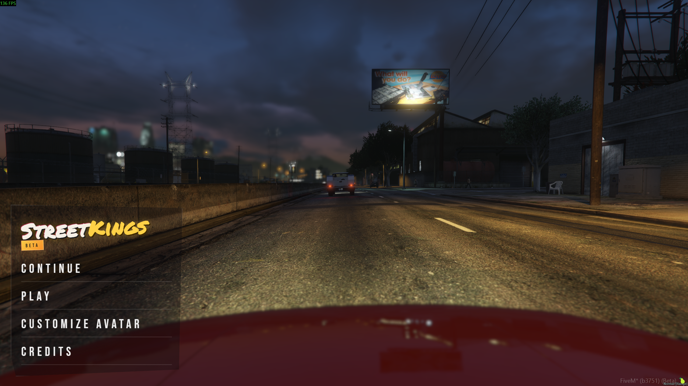
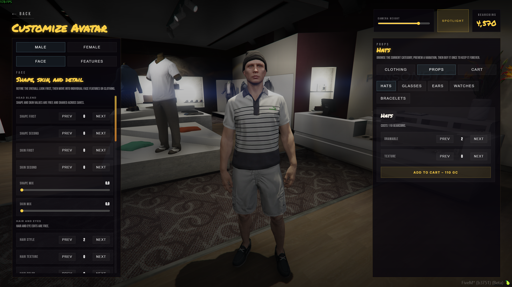
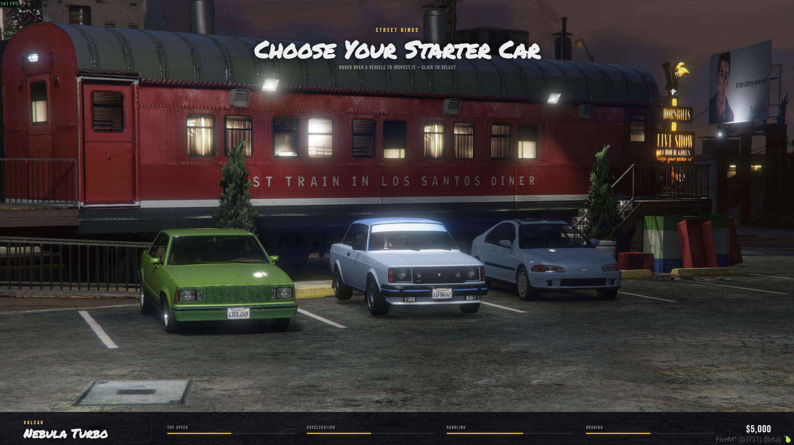
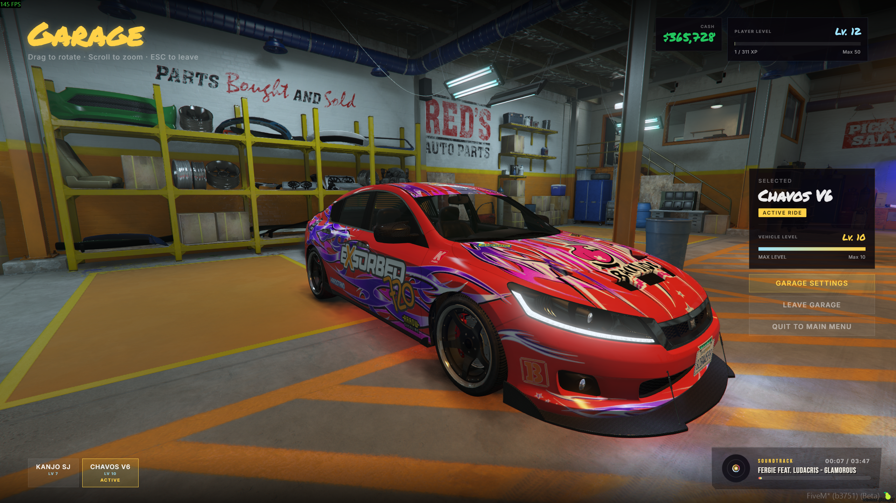
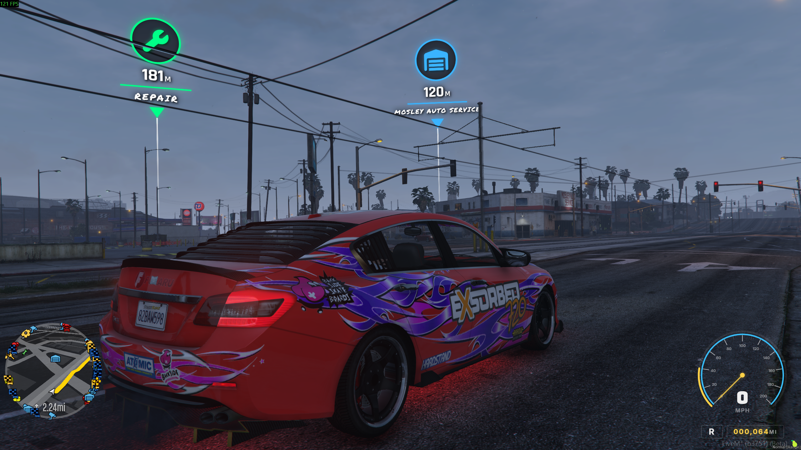
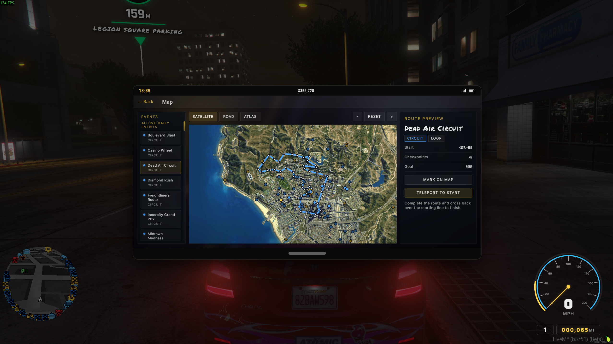

# 🏁 StreetKings

**A fully custom street racing gamemode for FiveM**

*Inspired by Midnight Club LA and the Black Box-era Need for Speed titles.*

*A collaboration between **919DESIGN** and **ENVI-SCRIPTS***

---

## Overview

StreetKings is a self-contained street racing gamemode built around car culture, organic discovery, and persistent progression. It treats FiveM as a proper game platform rather than a roleplay sandbox.

**Play now:** [`cfx.re/join/98geoy`](https://cfx.re/join/98geoy) &nbsp;•&nbsp; **Community:** [`discord.gg/cawQqAQXF3`](https://discord.gg/cawQqAQXF3)

---

## Screenshots

<table>
  <tr>
    <td></td>
    <td></td>
  </tr>
  <tr>
    <td></td>
    <td></td>
  </tr>
  <tr>
    <td></td>
    <td></td>
  </tr>
</table>

---

## Requirements

| Requirement | Notes |
|---|---|
| FXServer | Clean install, artifact `25770+` |
| `oxmysql` | Database connector (installed automatically) |
| `ox_lib` | Shared library (installed automatically) |
| Database | MySQL-compatible (MariaDB preferred) |

> **Base game assets only.** No MLOs, car mods, or map mods required. The only streamed assets are a custom map-blip stream and a native audio soundset bundled with the resource.

---

## Features

### 📖 Story
A mini-campaign of cinematic story missions introduces players to the world's theme and setting.

### 🎥 Custom Action Camera
A fully custom cinematic racing camera built from the ground up. Every bump, turn, brake, and jump is felt through the lens.

### 💾 Progression & Saves
- Per-player, per-vehicle XP and unlock tracking that persists between sessions
- Up to **3 save slots** per player, each with independent stats and progression
- Vehicle-specific upgrade history carried per car
- MySQL-backed save blob, so arbitrary data attaches to any feature without hard schema limits

### 🚗 Vehicles & Classes
- Five classes: **STARTER · C · B · A · S**
- Visual and performance upgrades unlocked through per-vehicle progression
- Discoverable dealerships organized by class, where higher tiers require sufficient player level
- Customizable discoverable garages with active vehicle management and recovery

### 🗺️ World & Discovery
- Performance shops, visual shops, garages, and dealerships are hidden and found naturally in freeroam
- Custom map blips for performance and visual shops give native-feeling blip variety
- Ambient NPC races triggered by doing a burnout at a red light

### 🏆 Events
| Event | Description |
|---|---|
| **Race** | Competitive multiplayer with sprint, circuit, and point-to-point structures |
| **Time Attack** | Solo leaderboard runs with global plus daily/weekly/monthly tracking |
| **Delivery** | Timed objective runs with police risk |
| **Speed Cameras** | Freeroam top-speed challenges rewarding leaderboard position |
| **Stunt Jumps** | Insane stunt challenges |
| **Rampage** | Timed chaos events; cause max damage and trigger a police pursuit |

> A **daily featured playlist** rotates event logic and rewards full completion.

### 📱 Phone Interface
- **TAB** opens the player phone, the central hub for events, stats, leaderboards, settings, and utilities
- Full controller support across all menus and phone interactions
- Built-in towing/recovery tools, map utilities, and event browsing

### 🚓 Police & Risk
- Server-controlled NPC police traps spawn dynamically across the map
- Radar detector system with custom native audio cues
- Wanted level triggered by traffic collisions and pedestrian incidents

### 🅿️ Hang Out Zones
- Players cannot freely exit their vehicle outside designated social zones
- Hang Out Zones enable proximity chat, car meetups, and on-foot gameplay

### 👕 Cosmetics
- Avatar clothing system with a gameplay-earnable currency (**GearCoins**)
- Avatar is per-account and carries across all save slots

### 📊 Leaderboards
- All race and challenge types tracked globally
- Filterable by **All Time · Daily · Weekly · Monthly**

---

## Credits

**Testing**
- 0nlyjim
- cf3cruse
- davidtexture
- Devexity
- drcroll
- magnets.
- NickSparx
- ProGamerDude
- zStretz
- t.dot.
- OGChroma

---

